# KV4P-Desktop

Desktop companion app for the [kv4p-ht](https://kv4p.com) open-source ham radio board (ESP32 + SA818).

KV4P-Desktop turns a kv4p-ht board into a full-featured desktop transceiver with FM voice, APRS, RF spectrum analysis, SSTV, Morse/CW, digital modes integration, file transfer, and scanning — all over a single USB cable.

## Screenshots

### Radio

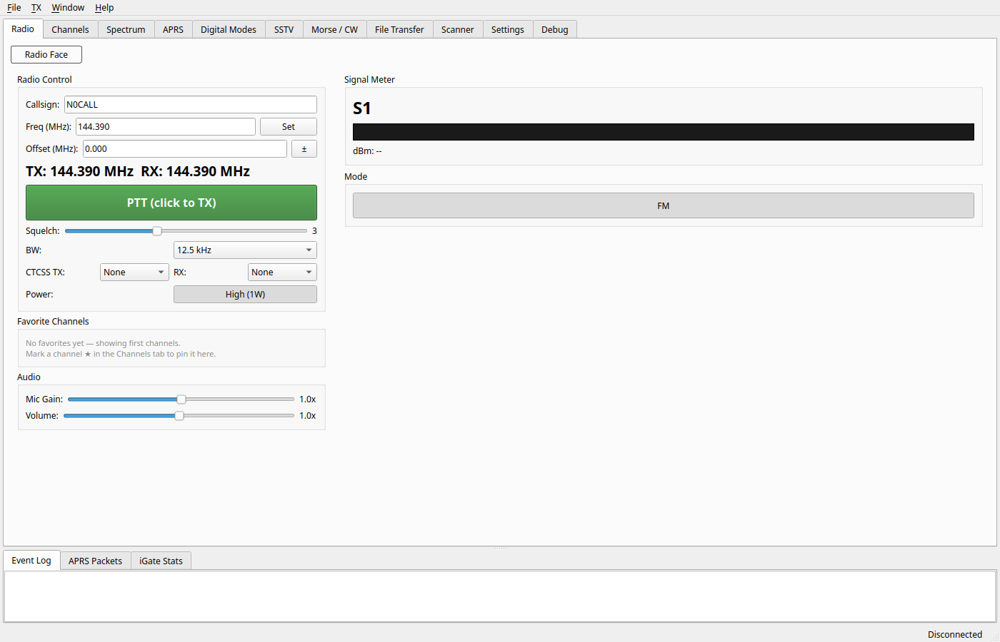

### Channels

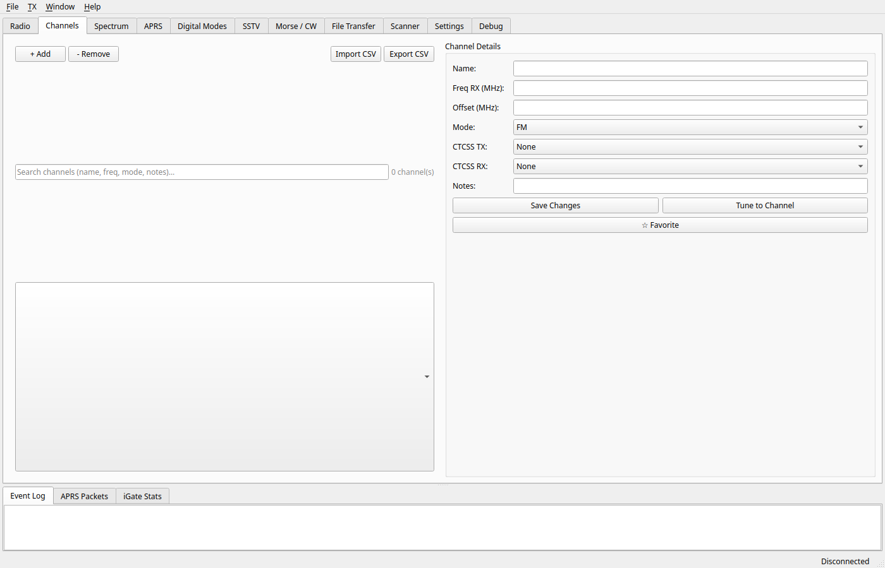

### Spectrum

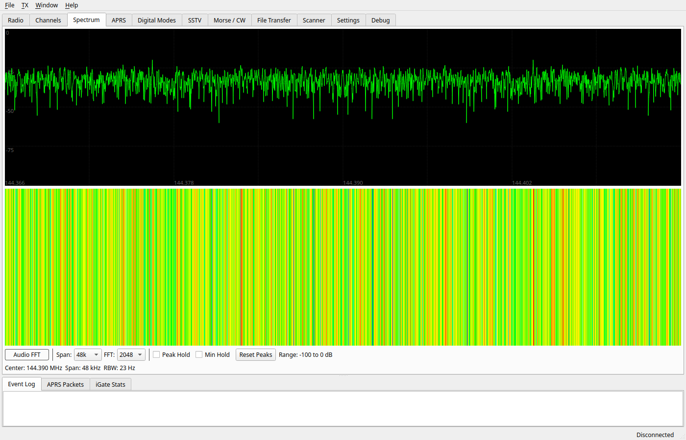

### APRS

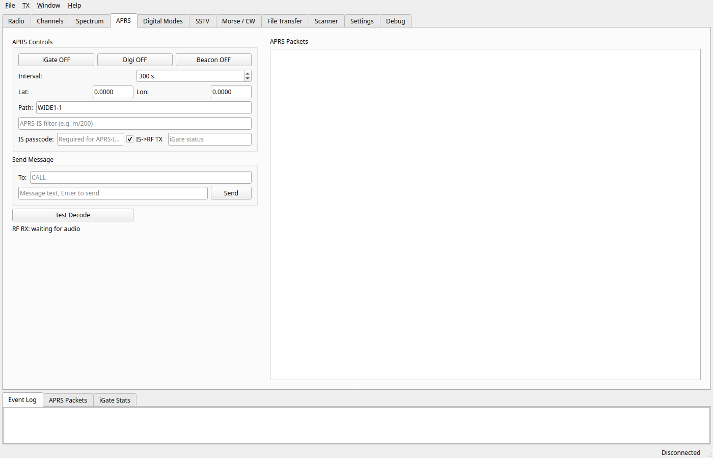

### Digital Modes

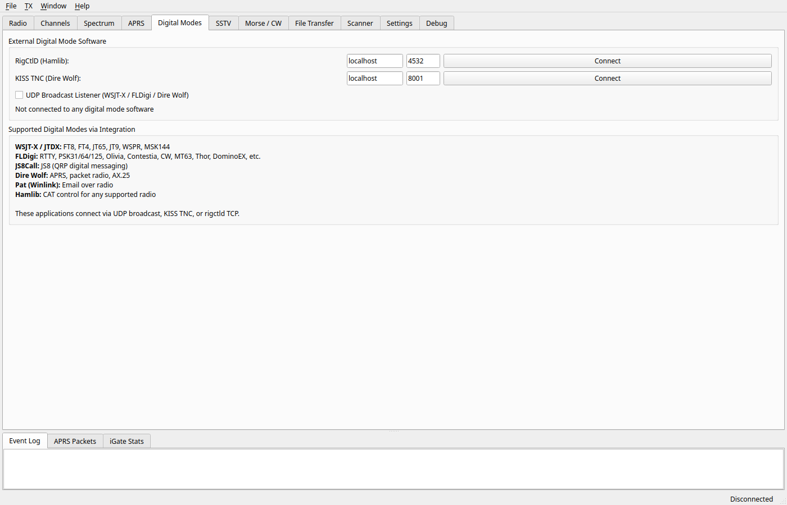

### SSTV

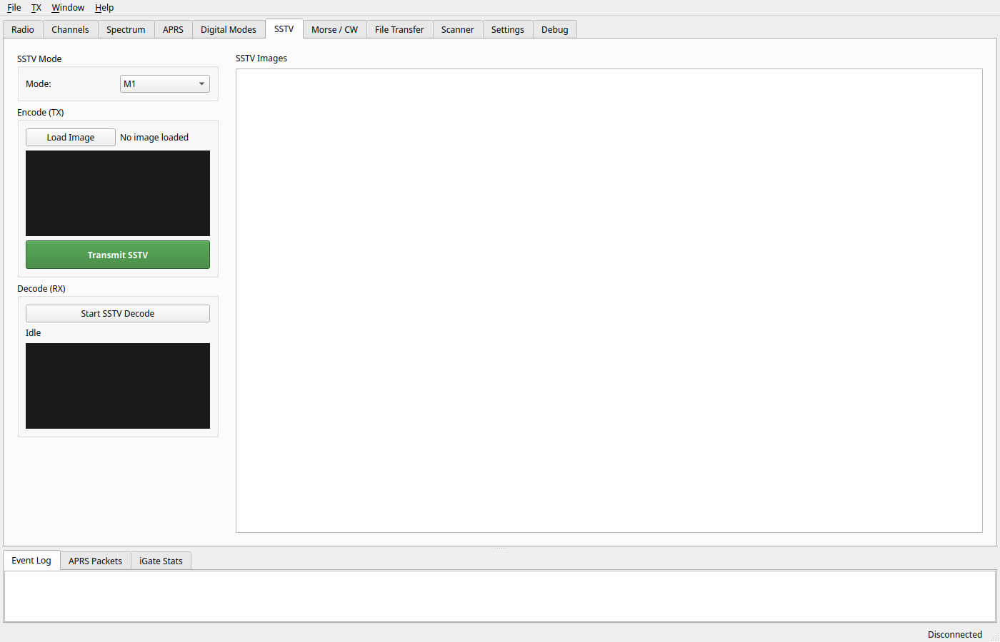

### Morse / CW

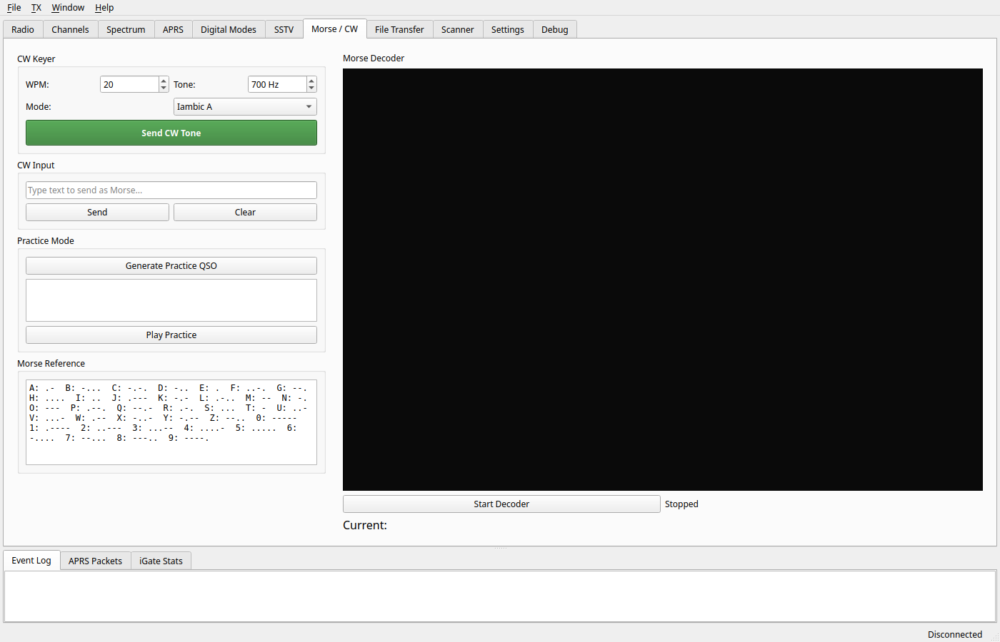

### File Transfer

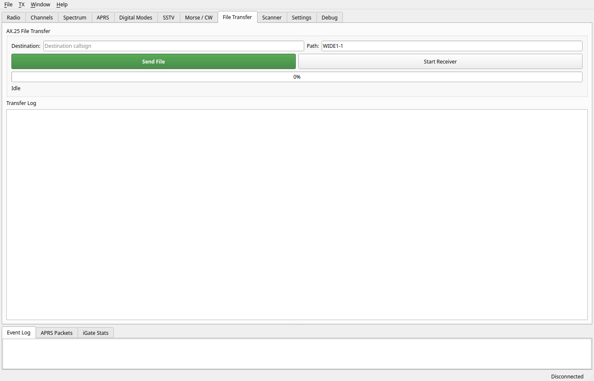

### Scanner

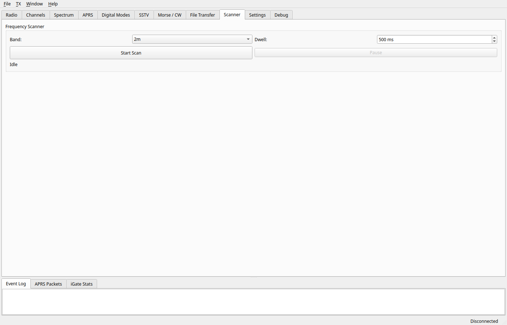

### Settings

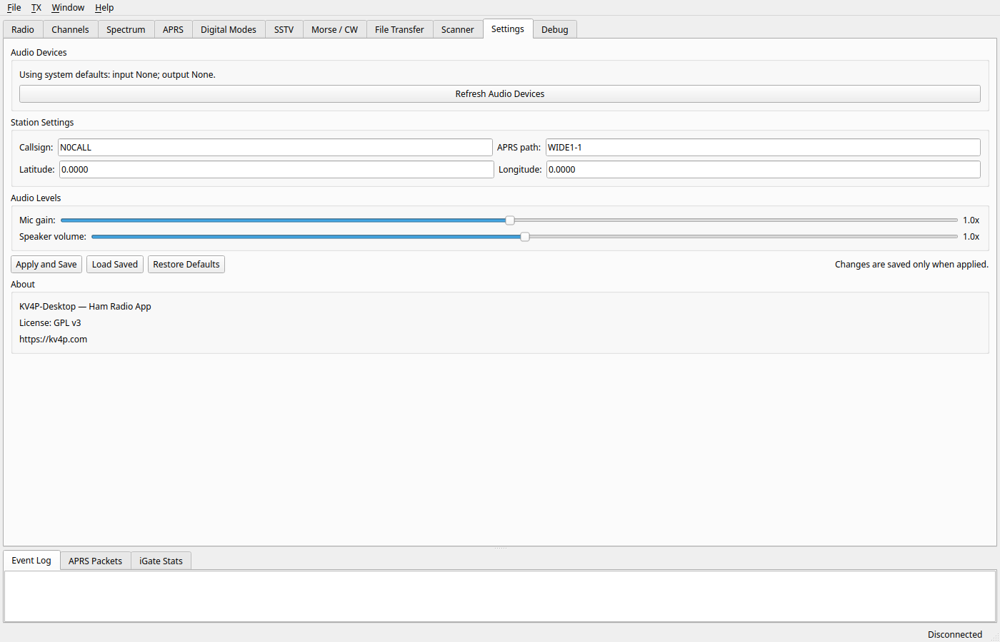

### Debug

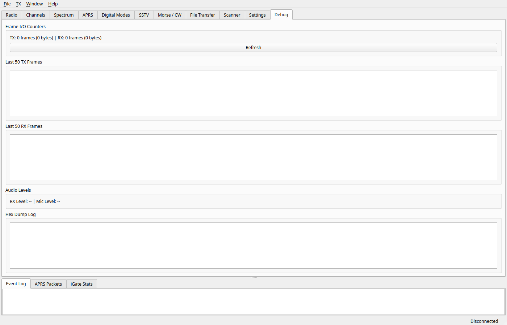

## Features

### Radio
- **FM Voice Transceiver** — Full-duplex audio via Opus codec over USB serial
- **PTT Control** — Software PTT button, physical PTT sync, and rigctld PTT from external apps
- **CTCSS Tones** — Transmit/receive CTCSS (PL tones) with full tone table
- **Squelch** — Adjustable squelch level (0–8)
- **Channel Memory** — Save/recall frequencies with name, offset, CTCSS, mode, and notes. Import/export CSV
- **Repeater Offset** — Configurable TX offset (+/– MHz)
- **Analog S-Meter** — Needle-style S-meter with color-coded segments
- **Radio Faceplate** — LCD-style frequency display and channel knob, toggleable with the desktop view

### APRS
- **iGate** — Bidirectional gateway between RF and APRS-IS (internet), with packet filtering and live stats
- **Digipeater** — Automatic packet forwarding with WIDEn-N path handling
- **Messaging** — Send/receive APRS text messages with automatic ACK
- **Beacon** — Periodic position beaconing with configurable interval and path
- **Position Display** — Decode and display position reports from received packets
- **Packet Log** — Live APRS packet viewer

### Spectrum Analysis
- **Audio FFT** — Real-time FFT of the audio path (configurable size, window, averaging)
- **RF Sweep** — Swept spectrum analyzer: hops through a frequency range reading RSSI at each step and plots power vs frequency. Default: 2m band (144–148 MHz), 25 kHz steps, ~4 s sweep
- **Waterfall Display** — Scrolling waterfall with color intensity mapping
- **Click-to-Tune** — Click the spectrum to jump to a frequency

### Digital Modes Integration
Drive the kv4p-ht from established digital-mode software — the app provides the modem glue:

| Software | Modes | Interface |
|----------|-------|-----------|
| WSJT-X / JTDX | FT8, FT4, JT65, JT9, WSPR, MSK144 | UDP broadcast |
| FLDigi | RTTY, PSK31/64/125, Olivia, Contestia, MT63, Thor, DominoEX, CW | UDP broadcast |
| JS8Call | JS8 QRP messaging | UDP broadcast |
| Dire Wolf / BPQ | APRS, packet radio, AX.25 | KISS TNC (TCP 8001) |
| Pat (Winlink) | Email over radio | KISS TNC |
| Any Hamlib app | CAT control | rigctld (TCP 4532) |

- **Hamlib/RigCtlD Server** — External apps set frequency, key PTT, and switch mode (FM/USB/LSB/AM/CW)
- **KISS TNC Server** — Standard AX.25 access for packet stacks

### SSTV
- **Encode** — Convert images to SSTV audio: Martin M1–M4, Scottie S1–S4/DX, PD-50/90/120, Robot 36
- **Decode** — Decode incoming SSTV transmissions with automatic VIS-code mode detection and image preview

### Morse / CW
- **CW Keyer** — Iambic and straight keyer with adjustable WPM
- **Morse Decoder** — Real-time decode of incoming Morse code
- **Practice Mode** — Random callsign/text generation for Morse training

### File Transfer
- **AX.25 File Transfer** — Send and receive files over AX.25 with packet sequencing, ACK/NAK, CRC-16 verification, and automatic retry

### Scanner
- **Band Plans** — Built-in 2m (144–148 MHz) and 70cm (420–450 MHz) plans with calling-frequency presets
- **Signal Detection** — Dwell time and RSSI threshold-based stop-and-hold scanning

### General
- **Persistent Settings** — Callsign, frequencies, and preferences saved across sessions
- **Audio Controls** — Mic gain and speaker volume sliders
- **Event Log** — Timestamped application log
- **Debug Console** — Full TX/RX frame hex dump and protocol logging
- **Self-Test** — Built-in AFSK demodulator test

## Requirements

- Python 3.11+
- A kv4p-ht board connected via USB
- Linux, macOS, or Windows with audio drivers
- System packages: `portaudio19-dev`, `libopus0` (Linux)

## Install

```bash
# System deps (Ubuntu/Debian)
sudo apt install python3-pip python3-pyqt6 portaudio19-dev libopus0

# Python dependencies
pip install -r requirements.txt
```

## Run

```bash
# Quick start
python run.py

# With options
python run.py --callsign KG4SHR --freq 146.520 --igate --beacon

# Full help
python run.py --help
```

## CLI Options

| Flag | Description |
|------|-------------|
| `--callsign CALL` | Default callsign |
| `--freq MHZ` | Initial RX frequency |
| `--offset MHZ` | Repeater offset |
| `--rigctl-host HOST` | Hamlib rigctld host |
| `--rigctl-port PORT` | Hamlib rigctld port (default 4532) |
| `--igate` | Start iGate on launch |
| `--beacon` | Start beacon on launch |
| `--scanner` | Start frequency scanner on launch |
| `--log-level LEVEL` | Log level (debug/info/warn/error) |

## UI Layout

Main tabs: **Radio · Channels · Spectrum · APRS · Digital Modes · SSTV · Morse/CW · File Transfer · Scanner · Settings · Debug**

Bottom dock tabs: **Event Log · APRS Packets · iGate Stats**

## Architecture

```
┌──────────────────────────────────────────────────────────┐
│              PyQt6 GUI (MainWindow)                       │
│ Radio | Channels | Spectrum | APRS | Digital | SSTV      │
│        CW | File Transfer | Scanner | Settings | Debug   │
└──────┬─────────────────────────────────────────┬─────────┘
       │ QThread signals                         │ queues
       ▼                                         ▼
┌──────────────┐                        ┌──────────────┐
│ SerialWorker │◄──── Opus ───────────►│ AudioWorker  │
│ USB serial   │                        │ mic/speaker  │
│ FrameParser  │                        │ Opus + AFSK  │
└──────┬───────┘                        └──────────────┘
       │ USB serial
       ▼
┌──────────────┐
│ kv4p-ht      │
│ ESP32+SA818  │
└──────────────┘

External Integrations:
  Hamlib apps    ── TCP/4532 ──> RigCtlD (freq/PTT/mode)
  Dire Wolf/BPQ  ── TCP/8001 ──> KissTnc
  WSJT-X/FLDigi  ── UDP      ──> UdpBroadcastRx
```

## Protocol

Communication between host and ESP32 uses a binary frame protocol:

```
Delimiter (4B): DE AD BE EF
Command (1B):   Host or ESP command code
Length (2B):    Payload length (little-endian)
Payload (0-2048B)
```

Host commands: PTT_DOWN, PTT_UP, GROUP (freq/squelch/tone), FILTERS, STOP, CONFIG, TX_AUDIO, RSSI, TX_AX25
ESP commands: SMETER, DEBUG, HELLO, RX_AUDIO, VERSION, WINDOW_UPDATE, RX_AX25

## Testing

```bash
python -m pytest tests/ -v
```

539 tests — no hardware needed, all mocked.

## Building Standalone Binary

### Linux
```bash
./build.sh
# Output: dist/kv4p-desktop
```

### Windows
```batch
build_windows.bat
:: Output: dist\kv4p-desktop.exe
```

### macOS
```bash
./build_macos.sh
# Output: dist/KV4P-Desktop.app
```

### Notes
- PyInstaller bundles Python interpreter + all deps into a single file (~110 MB)
- USB serial (pyserial) works out of the box on all platforms
- Audio (sounddevice) requires platform-native audio: ALSA/PulseAudio (Linux), WASAPI (Windows), CoreAudio (macOS)
- Opus codec (opuslib) links against system `libopus`

## License

GPL v3 — same as the parent kv4p-ht project.

Built by 5B4ANU.
